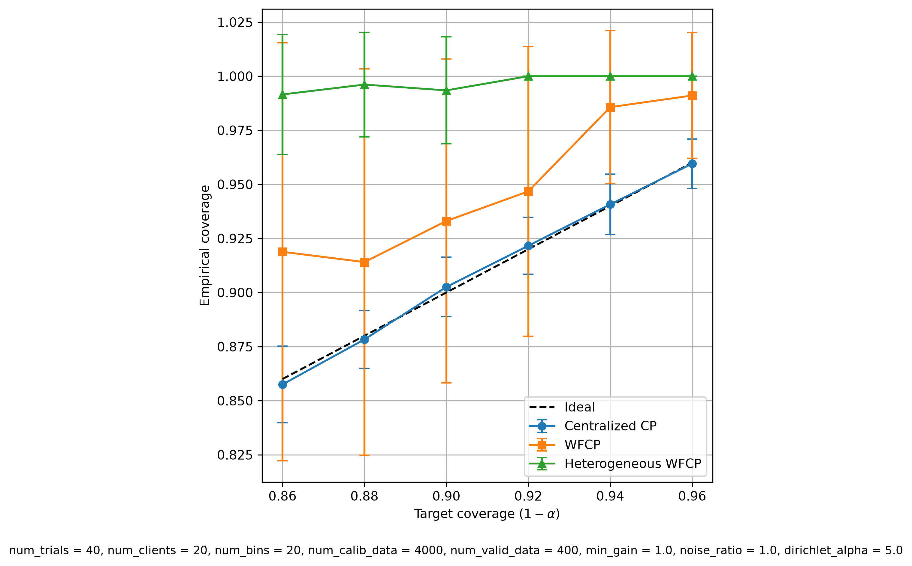
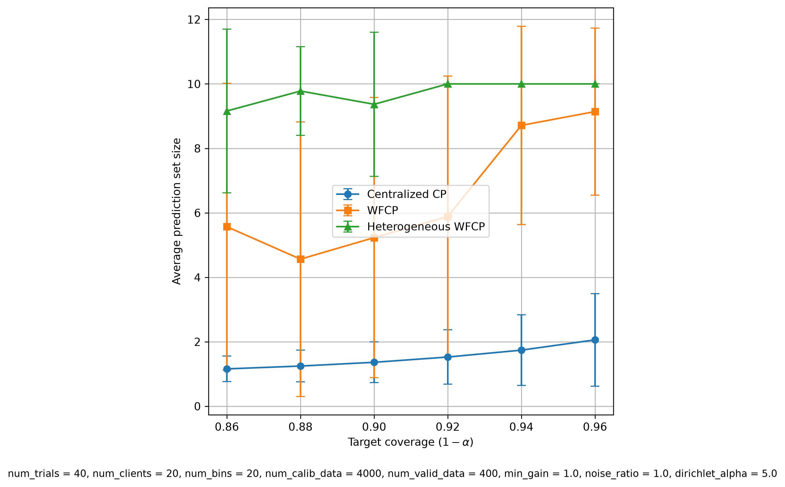
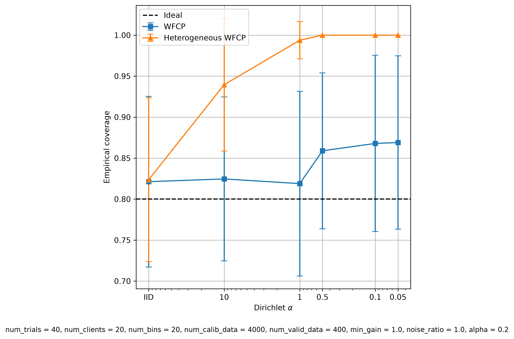
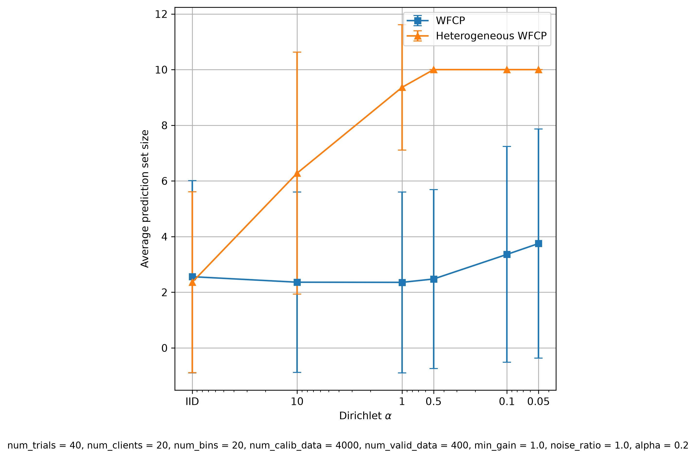
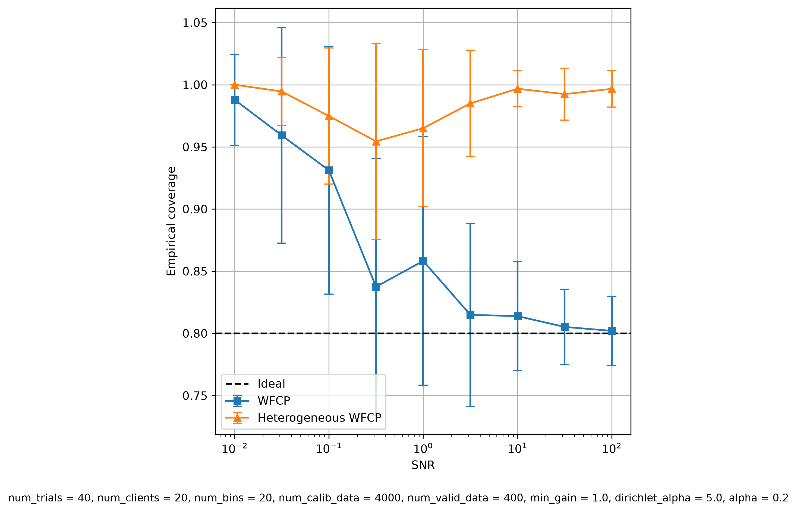
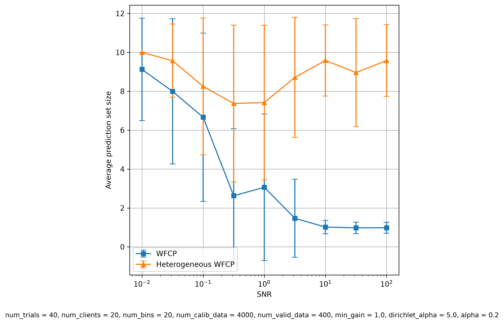

# Heterogeneous Extension of WFCP

## Overview
This project investigates the performance of Wireless Federated Conformal Prediction (WFCP) under heterogeneous
(non-IID) client data distributions. WFCP, introduced by (REF), is a distributed uncertainty quantification protocol
that enables multiple clients to collaboratively calibrate prediction sets while communicating over noisy wireless
channels. While the original protocol assumes that calibration data is homogeneously (IID) distributed across clients,
the authors propose a way to adapt the protocol to heterogeneous data distributions using the results of Lu et al. (2023).

The purpose of this project is to implement and evaluate the proposed heterogeneous extension of the protocol.
All experiments are performed using a CNN model trained on the CIFAR-10 image classification dataset.

This project was developed as my project for the Digital Future's Summer Research Internship 2026 (REF).

## Background

### Conformal Prediction
Conformal Prediction (CP) is a distribution-free statistical framework for uncertainty quantification
that can be wrapped around any predictive model to output prediction sets with formal coverage guarantees (Angelopoulos & Bates, 2023).
Rather than producing a single predicted label, CP generates a set that is guaranteed to contain the correct
label with a user-specified probability, known as the target coverage. These guarantees hold regardless
of the data distribution or underlying machine learning model. However, the guarantees rely on the
exchangeability of calibration data and test data. This exchangeability cannot be guaranteed in
a federated learning setting.

### Wireless Federated Conformal Prediction
WFCP (REF) extends CP to a federated inference setting in which multiple clients each
possess local calibration data while communicating with a central server over a noisy wireless channel.
Instead of transmitting raw data, clients communicate compressed statistical information that allows
the server to estimate a global conformal threshold. The protocol provides mechanisms to compensate
for channel noise while preserving the formal coverage guarantees of CP.

### My Contribution
The WFCP protocol as defined by (REF) assumes that calibration data is distributed identically across
all clients. (REF) proposes a theoretical way to adapt the protocol to scenarios where clients
receive data from different underlying distributions. This project implements the extension
proposed by (REF) and investigates the impact of heterogeneous client data on the performance
of both the original and the extended WFCP. A procedure based on the Dirichlet distribution was
impemented to generate verying degrees of non-IID datasets.

The major difference between the original WFCP and heterogeneous WFCP is in the threshold computation
performed by the server. In original WFCP, the server computes a correction term based on the average
number of calibration samples of each client. Since data is assumed to be IID, each client should have
roughly the same amount of samples. In heterogeneous WFCP, the correction term is instead computed based
on the maximum number of calibration samples of any client. I.e. if client A has 100 samples and client B has 50
samples, then the maximimum is 100. This results in the correction term being directly related to how heterogeneous
the data is. If the data is highly heterogenous, then the maximum number of samples is increased, as one client may
have many more samples than the others.

## Project Structure
The project follows a layered architecture. At the bottom layer are the simulated entities: Clients, Server,
and Channel. These components are then used in the Methods layer to implement the CP algorithms under evaluation. Finally,
the Experiments layer evaluates these methods by varying different parameters, including target coverage, degree of calibration
data heterogeneity, and signal-to-noise ratio.

```
┌──────────────────────────┐
│       Experiments        │
│--------------------------│
│ Target Coverage          │
│ Degree of heterogeneity  │
│ Signal-to-Noise Ratio    │
└────────────▲─────────────┘
             │
┌────────────┴─────────────┐
│         Methods          │
│--------------------------│
│ Centralized CP           │
│ WFCP                     │
│ Heterogeneous WFCP       │
└────────────▲─────────────┘
             │
┌────────────┴─────────────┐
│          Actors          │
│--------------------------│
│ Client                   │
│ Server                   │
│ Channel                  │
└──────────────────────────┘
```

## Results
The heterogeneous extension of WFCP was evaluated on the CIFAR-10 dataset by comparing its empirical coverage and prediction
set size against centralized CP (all calibration and testing is done on the same server, no clients or channel involved)
and the original WFCP protocol. The experiments investigate whether the coverage guarantees of WFCP are preserved
under heterogeneous calibration data and what effect increasing heterogeneity and channel noise has on the empirical
coverage and prediction set size. Each experiment reports the mean value computed over several trials, with each
trial drawing a new random sample of calibration and test data.

### Coverage under heterogeneous data
The first experiment evaluates whether moderately heterogeneous calibration data affects the coverage guarantees of WFCP.
Empirical coverage was measured for a range of target coverage levels and compared with centralized CP and the
original WFCP method.

The results show that all three methods achieve empirical coverage across the tested confidence levels.
Heterogeneous WFCP is clearly more conservative than homogeneous WFCP. This makes sense since the correction term
of the heterogeneous extension becomes stronger the more heterogeneous the data is. It is thus to be expected that it produces
larger prediction sets than WFCP when data is heterogeneously distributed among the clients. More interestingly perhaps is
how well the original WFCP method performs even under heterogenous data. Empirical coverage is maintained for all tested
coverage levels, while still producing smaller sets than heterogeneous WFCP.

<p align="center">
    
</p>
<p align="center">
    
</p>

### Effect of various degrees of heterogeneity
This experiment investigates the impact of various degrees of heterogeneity on the empirical coverage and prediction set size.
This is done by varying the Dirichlet $\alpha$ parameter. A larger $\alpha$ value indicates a distribution closer to IID. A
smaller $\alpha$ value indicates a more heterogeneous distribution.

The results show that both coverage and set size remain mostly constant for the original WFCP, even under highly heterogenous
data. Heterogeneous WFCP on the other hand becomes clearly more conservative as the heterogenity increases, eventually saturating
at maximum set size.

<p align="center">
    
</p>
<p align="center">
    
</p>

### Effect of channel noise under heterogeneous data
The final experiment studies the robustness of the heterogeneous WFCP extension to channel noise. The effect of imperfect
wireless communication on both coverage and prediction set size is evaluated by varying the signal-to-noise ratio (SNR).

The results demonstrates that heterogeneous WFCP retains the robustness of the original WFCP protocol. Empirical coverage
is maintained even when data is sent over a noisy channel.

<p align="center">
    
</p>
<p align="center">
    
</p>

### Conclusions
The experiments indicate that the original WFCP performs surprisingly well even under highly heterogeneous data. This raises the
question of whether the heterogeneous extension is even necessary. The extension clearly produces larger prediction sets for all
tested coverage levels and degrees of heterogeneity, making it seem a worse choise than homogeneous WFCP in all tested cases.

It is worth noting that these experiments include some limiting factors, the biggest two of which are a limited number of trials
and only a single dataset. All experiments run for at most 40 trials, which is small compared to the 400 trials run by (REF). Running
more trials would surely produce a more accurate result. The other limiting factor is that this study has focused only the CIFAR-10 image
classication dataset. It is possible that other datasets, or other underlying predictive models, may produce different results. In a scenario
where the original WFCP fails to achieve empirical coverage under heterogeneous data, these results indicate that heterogeneous WFCP may still
achieve empirical coverage due to being more conservative as the degree of heterogeneity increases.

## How To Use

### Libraries
Matplotlib, version 3.11.0

NumPy, version 2.5.0

Tensorflow, version 2.21.0

### Running Experiments
All experiments are executed through the `main.py` module. Experimental parameters, such as the target coverage, degree of heterogeneity,
signal-to-noise ratio, and number of trials, can be configured directly in the script before execution. Note that the number of trials will
greatly determine the runtime of the experiments.

Generated figures are automatically saved to the `figures/` directory.

### Running Tests
Unit tests are included in the `tests/` directory. All tests can be run with
```
python -m unittest discover -s tests
```

## References
Angelopoulos, A. N., & Bates, S. (2023). Conformal Prediction: A Gentle Introduction.
Foundations and Trends in Machine Learning, 16(4), 494–591.
https://doi.org/10.1561/2200000101

Lu, C., Yu, Y., Karimireddy, S. P., Jordan, M., & Raskar, R. (2023). Federated Conformal
Predictors for Distributed Uncertainty Quantification. Proceedings of the 40th
International Conference on Machine Learning, in Proceedings of Machine Learning
Research 202:22942-22964 Available from
https://proceedings.mlr.press/v202/lu23i.html

M. Zhu, M. Zecchin, S. Park, C. Guo, C. Feng & O. Simeone. (2024). Federated Inference
Quantification Over Wireless Channels via Conformal Prediction. IEEE Transactions on
Signal Processing, vol. 72, pp. 1235-1250.
https://doi.org/10.1109/TSP.2024.3358615